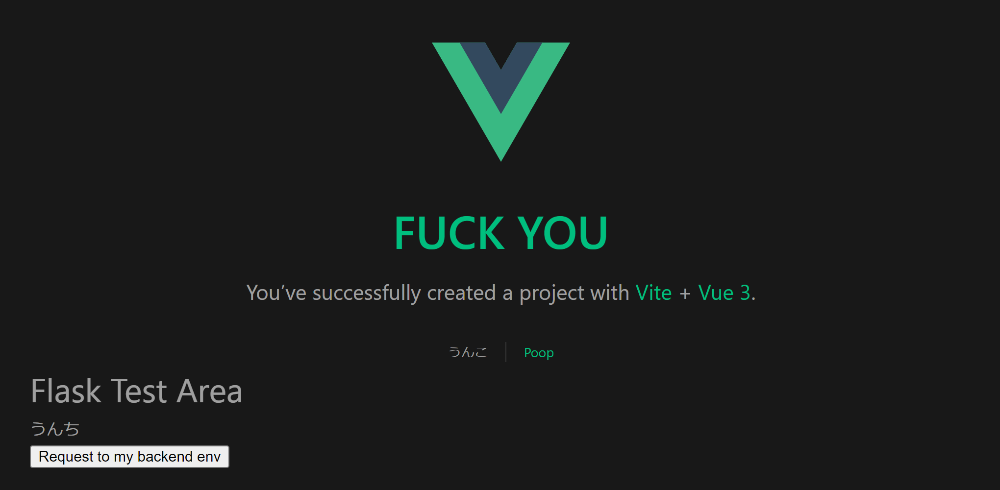
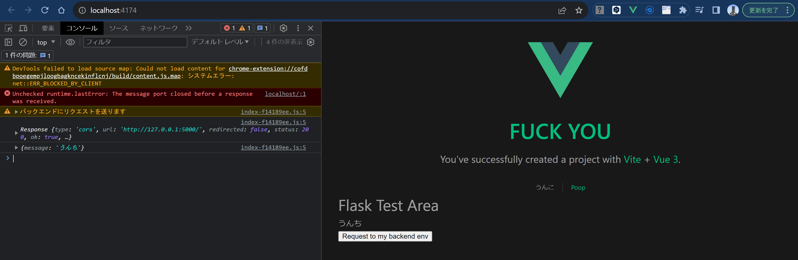

# 概要
このデモは、Flask + Vue3の連携のやり方を確認するための簡単なGETリクエストのデモです。

## フロントエンドの起動方法
* お使いのPCにNode.jsがインストールされ、npmコマンドが使えることを前提とします。
 * Node.js : 18.16.0
 * npm : 9.5.1

1. Frontendへ移動
```bash
cd Frontend
```
2. Vue3の環境構築＋パッケージのインストール
```bash
npm install
```
3. フロントエンドのビルド
```bash
npm run build
```
4. ローカルサーバーの起動
```bash
npm run start
```
5. 表示されたURLにアクセス
6. のような画面が表示されれば成功です。

## バックエンドの起動方法
1. Backendへ移動
```bash
cd Backend
```
2. venv仮想環境の用意
```bash
python -m venv .venv
```
3. venv仮想環境の有効化し、パッケージのインストール
```bash
pip install -r requirements.txt
```
4. バックエンドの起動
flaskの環境変数を設定してから起動します。
```bash
flask run
```

## フロントエンドとバックエンドの連携
このデモでは、画面上のボタンを押下すると、サーバーに対して、HTTPリクエストを送信し、サーバーから以下のJson固定値が返却される仕組みです。
```json
{
    "message": "うんち"
}
```
この返却値をパースし、リアクティブなVueの変数を更新して表示を変更しています。


### Flaskサーバー側の実装
今回は単純なデモなので、ルートパスのみで実装しています。
```python
from flask import Flask
from flask_cors import CORS

app = Flask('__name__')
CORS(app)

@app.route('/')
def index() -> str:
    response = {
        'message': 'うんち'
    }
    return response
```

### Vue.js側のサーバーへのリクエスト
fetch関数を使って、サーバーへリクエストを送信しています。
```javascript
const RequestToBackEnd = () => {
  console.warn("バックエンドにリクエストを送ります")
  fetch('http://127.0.0.1:5000') //バックエンドのURL,エンドポイントを指定
    .then((response) => {
      console.log(response) //responseには、サーバーからのレスポンスが格納されている
      return response.json();
    }).then((data) => {
      console.log(data)
      message.value = data.message;
    }).catch((error) => {
      console.error(error);
    })
}
```

### 結果
ボタンを押下すると以下のように、サーバーからレスポンスが帰ってきて、Vueのフロントエンドと連携できることを確認できます。
